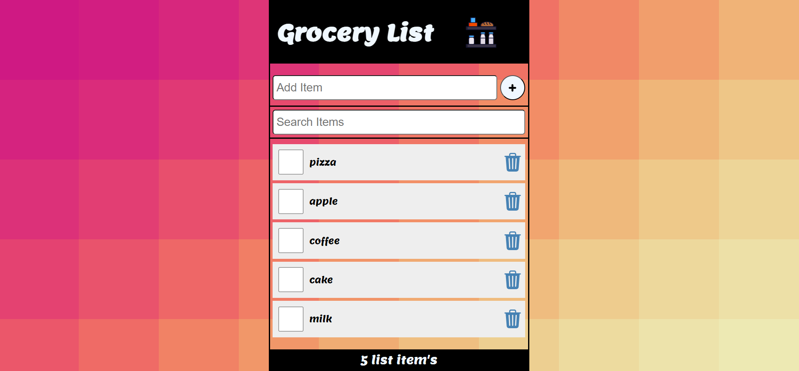

# Grocery-List
Grocery List
This is a simple and easy-to-use grocery list app that helps you keep track of your grocery needs. With this app, you can easily add, edit, and delete items from your list, making grocery shopping a breeze.

# Features
- Add, edit, and delete items from your grocery list
- Keep track of what you need to buy
- Simple and easy-to-use interface
   
# Installation
To install this app, simply clone the repository and follow the instructions in the documentation.

```
git clone https://github.com/adas0mahdi/Grocery-List.git
```


# Usage
```
To use the app, simply open it and start adding items to your list. You can edit or delete items as needed.
```

# Contributing
Contributions are welcome! If you have any suggestions or improvements, feel free to open an issue or submit a pull request.

# License
This project is licensed under the MIT License. See the LICENSE file for more information.

<br>
<br>
<br>

. 

